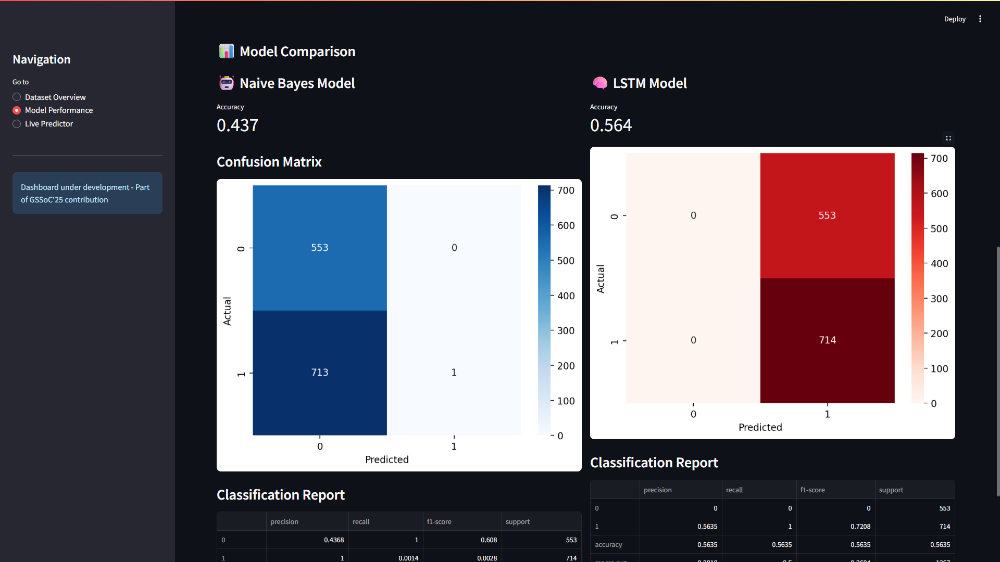

# 🔍 QuickFactChecker Dashboard


 

This project is a Streamlit-powered dashboard for analyzing and predicting fake vs real news using Naive Bayes and LSTM models. It provides dataset insights, model evaluation metrics, and live predictions.

**Live Demo:** [Insert your live demo URL here]

---

## Project Overview
QuickFactChecker Dashboard allows users to:
- Explore the LIAR dataset (training, test, validation)
- Analyze model performance metrics (accuracy, confusion matrix, classification report)
- Make live predictions on new text inputs
- Visualize feature importance using LIME explanations

---

## Technologies Used
- Python 3.11  
- Streamlit 1.30  
- Pandas, NumPy  
- Scikit-learn  
- TensorFlow / Keras  
- Matplotlib & Seaborn  
- LIME  

---

## Dashboard Execution Guide

### Steps to Run Project

```bash
# 1. Clone the repository
git clone https://github.com/<your-username>/<repo-name>.git

# 2. Checkout the branch (if any)
git checkout <branch-name>

# 3. Navigate into the dashboard folder
cd QuickFactChecker/dashboard

# 4. (Optional) Create virtual environment
python -m venv venv
# Activate venv
# Windows
venv\Scripts\activate
# Linux/Mac
source venv/bin/activate

# 5. Install dependencies
pip install -r requirements_dashboard.txt

# 6. Run the Streamlit dashboard
streamlit run dashboard.py
```
---
### Folder Structure
```
QuickFactChecker/
│
├─ dashboard/
│   ├─ artifacts/          # Saved models, tokenizers, max_length files
│   ├─ dashboard.py        # Main Streamlit dashboard
│   ├─ train_lstm.py       # LSTM training script
│   ├─ train_models.py     # Model training utilities
│   └─ requirements_dashboard.txt
│
├─ dataset/
│   └─ liar/               # LIAR dataset files: train.tsv, test.tsv, valid.tsv
│
└─ README.md
```
---

### Usage

- Open the dashboard via Streamlit
- Navigate using the sidebar:
- Dataset Overview: View dataset stats and label distributions
- Model Performance: Check Naive Bayes and LSTM metrics
- Live Predictor: Test new statements for fake/real news
- Use LIME explanations to understand model predictions

---

### Screenshots





---

### Use Case

- **Who is it for?** Journalists, researchers, developers, and anyone interested in fact-checking news content.
- **What does it do?** Detects fake vs real news from textual statements.
- **How does it work?** Uses Naive Bayes and LSTM models trained on the LIAR dataset.
- **Integration needed?** Can be integrated into web apps or internal tools for live news analysis.
---

### Future Integration Suggestions

- Deploy on cloud platforms (Hugging Face Spaces, Streamlit Cloud, AWS)
- Add multi-language support
- Include more advanced NLP models (BERT, RoBERTa)
- Real-time API for automatic news validation

---

MIT License

Copyright (c) 2025 Vandita Yadav

Permission is hereby granted, free of charge, to any person obtaining a copy of this software and associated documentation files (the "Software"), to deal in the Software without restriction, including without limitation the rights to use, copy, modify, merge, publish, distribute, sublicense, and/or sell copies of the Software, and to permit persons to whom the Software is furnished to do so, subject to the following conditions:

The above copyright notice and this permission notice shall be included in all copies or substantial portions of the Software.

THE SOFTWARE IS PROVIDED "AS IS", WITHOUT WARRANTY OF ANY KIND, EXPRESS OR IMPLIED, INCLUDING BUT NOT LIMITED TO THE WARRANTIES OF MERCHANTABILITY, FITNESS FOR A PARTICULAR PURPOSE AND NONINFRINGEMENT. IN NO EVENT SHALL THE AUTHORS OR COPYRIGHT HOLDERS BE LIABLE FOR ANY CLAIM, DAMAGES OR OTHER LIABILITY, WHETHER IN AN ACTION OF CONTRACT, TORT OR OTHERWISE, ARISING FROM, OUT OF OR IN CONNECTION WITH THE SOFTWARE OR THE USE OR OTHER DEALINGS IN THE SOFTWARE.